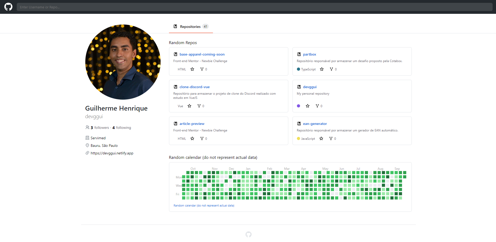

# GITHUB CLONE


> Este é um clone simples da plataforma [Github](https://github.com) realizado com base num desafio proposto pela [Rocketseat](https://www.rocketseat.com.br)

<div
  style="width:100%; display:flex; align-items:center; gap:16px" 
>

</div>

## Detalhes do aplicativo

- O desafio foi proposto para aprimorar os conhecimentos técnicos com frontend e backend, realizado um clone da plataforma Github utilizando React, Styled Components
e o acesso a API do Github.


## 🚀 Melhorias implementadas
- [x] - Acesso direto a API do Github para exibição das informações em tempo real
- [x] - Estilização com styled components


## 💻 Como usar o projeto
Para gerar uma cópia do projeto e implementar as suas melhorias, esteja em um computador com Node Js instalado e siga as etapas abaixo:

1  clone o projeto com o comando 
```
git clone https://github.com/devggui/clone-github
``` 
2  Acesse o projeto pelo terminal com o comando 
```
cd clone-github
```  
3  Instale as dependências necessárias com o comando
```
npm install
```

4  Rode o projeto com o comando
```
npm start
``` 

## 🌐 Links úteis
[ReactJS](https://react.dev)  
[Styled Components](https://styled-components.com)  


## 🧑‍💻 Guilherme Henrique

[](https://www.linkedin.com/in/devggui)
[](https://gthub.com/devggui)
[](http://wa.me/5514998619263)
[](https://devggui.netlify.app)